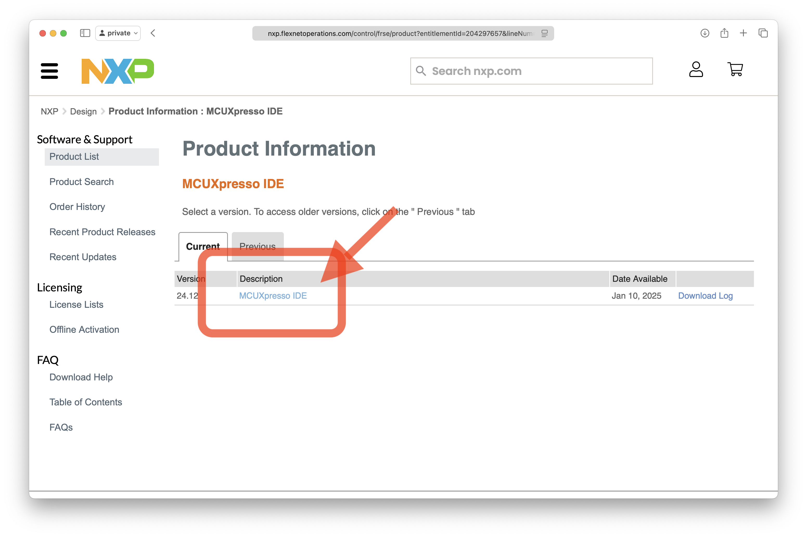
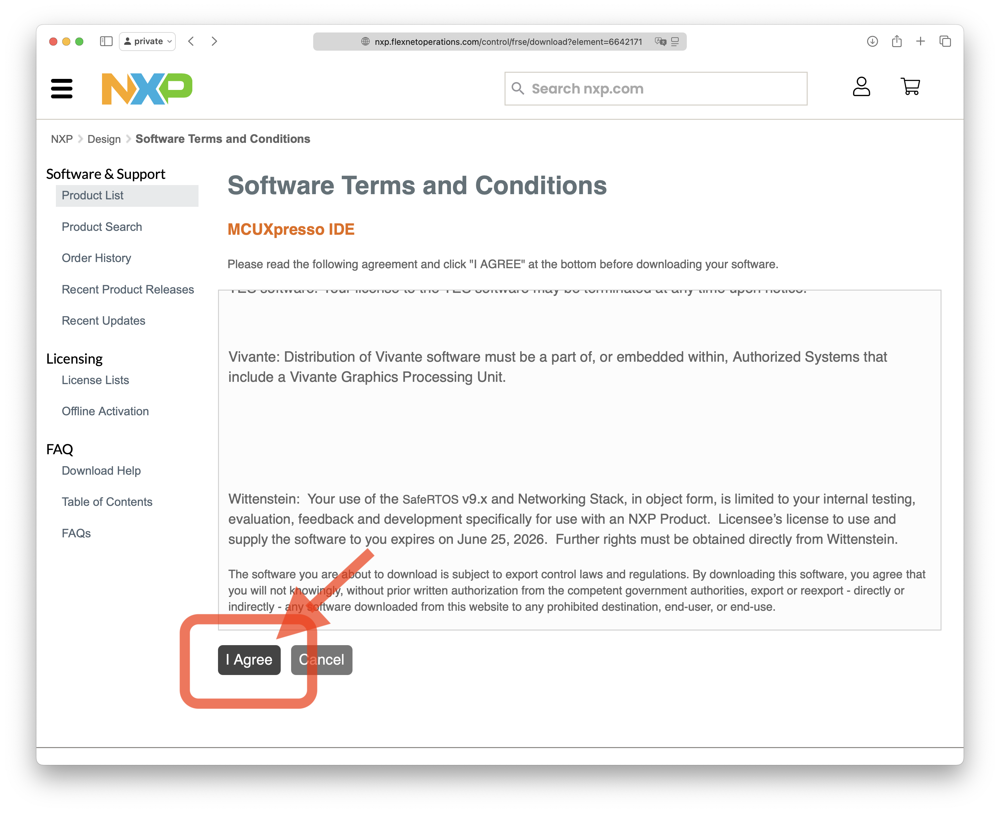
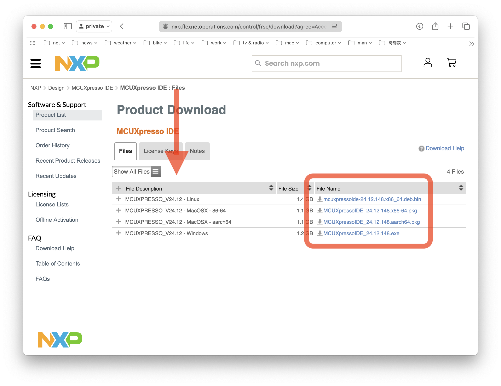
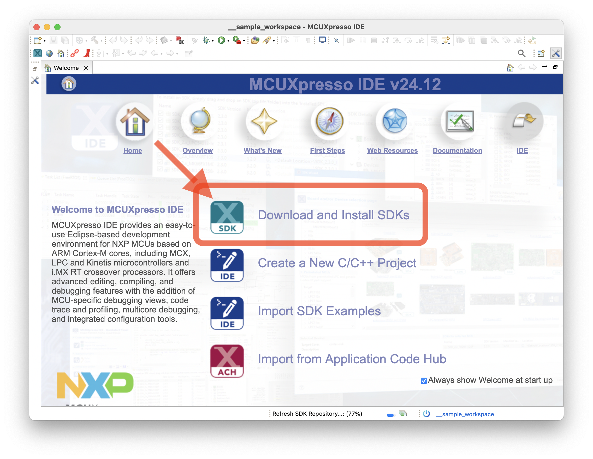
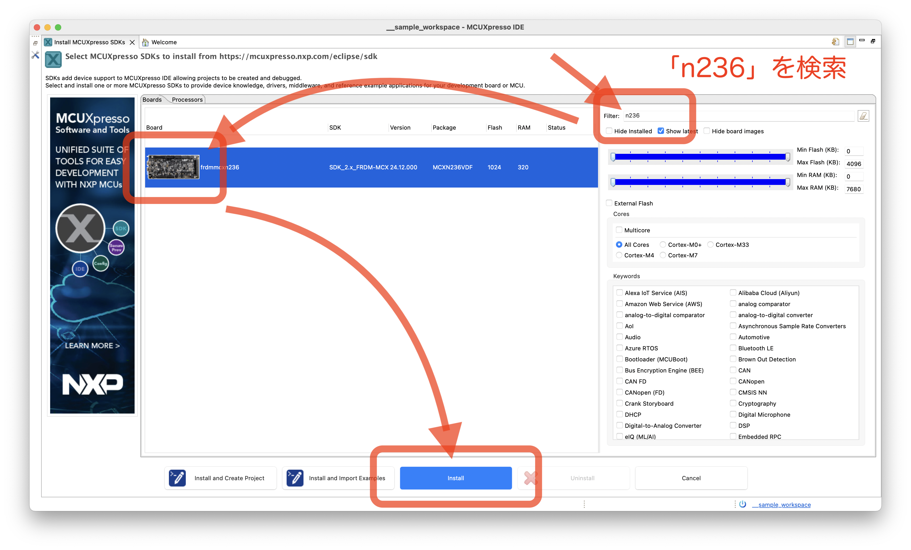
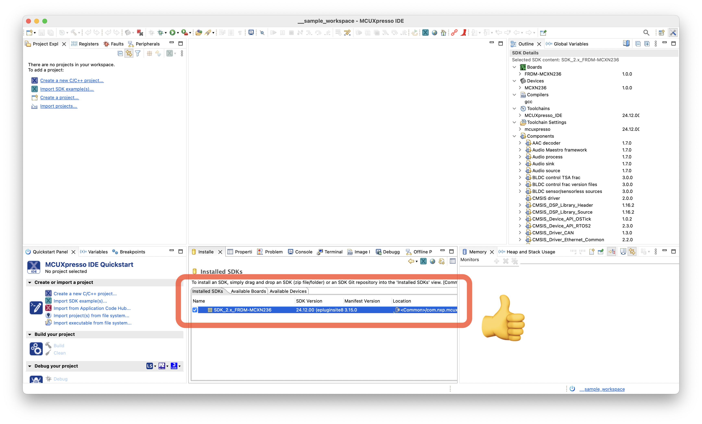

# mcx_handson_prototypes

## これはなに？

MCUXpressoとFRDM-MCXxxxxを使用したハンズオン用サンプルコードを作成しているので，それを共有するリポジトリ．  
このリポジトリはクローンするか，zipをダウンロードしてMCUXpresso IDEまたはMCUXpresso VSCにインポートできます．  

現在のサンプルコードは作成途中．さらにターゲットはN236の基板のみ．  
各基板用のライブラリに対応することで，N947, N236, A153基板でも実行可能．  

..の予定でしたが，とりあえずターミナルへの出力に`printf`ではなく`cout`を使うことにしたので，フラッシュサイズの小さいA153には入らなくなってしまいました💦  
なので，そのままのコードで実行可能なのはN236，N947，A156です．  

## これを動かすためには
### これらのサンプルプロジェクトの動作を試してみるには，ハードウェアとソフトウェアの準備が必要です．
#### ハードウェア
NXPのマイコン評価基板[FRDM-MCXN236](https://www.nxp.jp/design/design-center/development-boards-and-designs/FRDM-MCXN236)を用意します．  
基板をPCとUSBで接続します．基板には2つのUSB Type-Cコネクタがありますが，このうちJ10(MCU-Link)を使います．

#### ソフトウェア
まず，[nxp.com](http://www.nxp.com/)を開いて，MyNXPユーザアカウントを作成します．  

次に[MCUXpresso IDE](https://www.nxp.jp/design/design-center/software/development-software/mcuxpresso-software-and-tools-/mcuxpresso-integrated-development-environment-ide:MCUXpresso-IDE)をダウンロードし，インストールします(自身のPC環境に適したものを選んでください)．  






インストール終了後，MCUXpresso IDEを起動し，FRDM-MCXN236用のSDKをインストールします．  





このサイト([mcx_handson_prototypes](https://github.com/teddokano/mcx_handson_prototypes))からリポジトリをクローンまたはダウンロードし，MCUXpresso IDEにインポートします．  

## 中身
### プロジェクト
数字から始まる名前のプロジェクト(フォルダ)は段階的にハンズオンを進めていくための，それぞれのサンプルコードを収録． 

#### `0_*` サンプル・プロジェクト
FRDM基板での単独実行
- 0_0_Hello_world
    - `printf`を使った「Hello, world!」の印字テスト．出力は標準出力(デフォルトでSemihost設定．デバッガ内に出力)
- 0_1_LED_blink
	- GPIOピン制御によるLED点滅サンプル．インスタンスに`0`を代入することでGPIOにLOWが出力される．LEDのON/OFFは負論理になっているので0で点灯．1で消灯
- 0_2_LED_colors
	- 赤緑青のそれぞれのLEDの点灯実験．GPIOを3つ使っての制御
- 0_3_Button_in
	- ボタンスイッチ(SW3)を押すことで，値が0になることを検出して変数の値をカウントアップ
- 0_4_Button_controlled_LED
	- ボタンを押すことによってLEDの点灯色を切り替える例
- 0_5_function
	- "Button_controlled_LED"の色切替処理を関数にまとめてみた例．C言語のコードのまとめかたについて説明
- 0_6_Class
	- C++のクラスについての説明．これまで使っているクラスとインスタンスについての理解を深める

#### `2_*` サンプル・プロジェクト
FRDM基板での単独実行．同基板搭載の加速度センサFXLS8974を使う例
- 2_0_onboard_FXLS8974
	- 加速度センサから得られる情報の確認用
- 2_1_onboard_FXLS8974
	- XYZ方向の加速度の合成例
- 2_2_onboard_FXLS8974
	- X，Y方向への傾きを検出する例
- 2_3_onboard_FXLS8974
	- X，Y方向への傾きでLEDの色を変える例

#### `9_*` サンプル・プロジェクト
- 9_0_SoftPWM
	- LEDドライバの基板を使ってみる前に，PWMについての理解を深めるためのデモ．1Hz，2Hz，10Hz，100Hzのそれぞれの周波数で，10%，20%，40%，80%のデューティ比出力を試してみる．


#### ` _r01lib_frdm_mcx*` ライブラリ 
サンプルコードと一緒に使うライブラリ．FRDM基板をC++のAPIで抽象化．N947，N236，A156, A153用のライブラリがあル．このサンプル・リポジトリには下記のいずれかのライブラリ・プロジェクトが含まれる．
- _r01lib_frdm_mcxa153
- _r01lib_frdm_mcxa156
- _r01lib_frdm_mcxn236
- _r01lib_frdm_mcxn947

#### `pp_template_FRDM_MCX*` プロジェクト・テンプレート
各FRDM基板に対応したライブラリを使うための設定を行ったアプリケーションプロジェクトの雛形．  
`source/main.cpp`ファイルを書き換え/置き換えることで，独自アプリケーションを作成可能．末尾の「FRDM_MCXxxxx」が対応基板を示す．  下記のいずれかのライブラリ・プロジェクトが含まれる．
- app_template_FRDM_MCXA153
- app_template_FRDM_MCXA156
- app_template_FRDM_MCXN236
- app_template_FRDM_MCXN947

#### その他ファイル
- README.md
	- このファイル
- LICENSE
	- ライセンスを明示するためのファイル
- script/
	- プロジェクト管理用のスクリプト．このサンプル・リポジトリのリリース時などに使う．ユーザは特に意識する必要はない

## このリポジトリの最新版について
このリポジトリに含まれるサンプル・プロジェクトは[r01lib_prj_generator](https://github.com/teddokano/r01lib_prj_generator)を用いて，以下のコマンドで生成されています．  
各プロジェクトに含まれるサンプルコードのソースは，[r01lib_prj_generator](https://github.com/teddokano/r01lib_prj_generator)の`source_files/mcx_handson_prototypes_iostream`からコピーされています．

```
./script/gen_prj.py source_files/mcx_handson_prototypes_iostream -t 236
```

このコマンドの`-t 236`はFRDM-MCXN236用のプロジェクトを作成するためもの．この部分を`-t 947`のように指定することで，ターゲット評価基板を変更できます．たとえばFRDM-MCXA156用のプロジェクトを作成する場合は以下のようなコマンドで生成できます．

```
./script/gen_prj.py source_files/mcx_handson_prototypes_iostream -t 156
```
